# foryourhealth111-pixel/Vibe-Skills

> A skills governed plug-and-play harness for staged, test-driven skill orchestration

## 基本信息

| 字段 | 内容 |
|---|---|
| 名称 | foryourhealth111-pixel/Vibe-Skills |
| 链接 | https://github.com/foryourhealth111-pixel/Vibe-Skills |
| 来源聚合 | Development and Testing |
| 分类路径 | 测试质量 / 单元测试 / 单元/质量门禁 |
| 类型 | AI Skill / Agent Tool |

## 简介

A skills governed plug-and-play harness for staged, test-driven skill orchestration

## README / Skill 文档

  <strong>English</strong> | <a href="./README.zh.md">中文</a>

<h1 align="center">
  <picture>
    <source media="(prefers-color-scheme: dark)" srcset="./docs/assets/readme-wordmark-dark.svg">
    
  </picture>
</h1>

<picture>
  <source media="(prefers-color-scheme: dark)" srcset="./docs/assets/readme-tagline-en-dark.svg">
  
</picture>

 

<a href="https://github.com/foryourhealth111-pixel/Vibe-Skills/releases/latest">
  <strong>Latest release · v4.0.0</strong>
</a>

 

<a href="./docs/install/README.en.md">
  <picture>
    <source media="(prefers-color-scheme: dark)" srcset="./docs/assets/install-cta-en-dark.svg">
    <source media="(prefers-color-scheme: light)" srcset="./docs/assets/install-cta-en-light.svg">
    
  </picture>
</a>

 

<a href="./docs/quick-start.en.md">Quick start</a> ·
<a href="https://github.com/foryourhealth111-pixel/Vibe-Skills/actions/workflows/vco-gates.yml">Current CI & proof</a> ·
<a href="https://github.com/foryourhealth111-pixel/Vibe-Skills/releases/latest">Release notes</a> ·
<a href="./docs/README.md">Documentation</a> ·
<a href="https://github.com/foryourhealth111-pixel/Vibe-Skills/stargazers">Star the project</a>

<code>pwsh ./check.ps1</code> reports the current local runtime state.

  <picture>
    <source media="(prefers-color-scheme: dark) and (max-width: 600px)" srcset="./docs/assets/readme-preface-v2-en-mobile-dark.svg">
    <source media="(prefers-color-scheme: light) and (max-width: 600px)" srcset="./docs/assets/readme-preface-v2-en-mobile-light.svg">
    <source media="(prefers-color-scheme: dark)" srcset="./docs/assets/readme-preface-v2-en-dark.svg">
    <source media="(prefers-color-scheme: light)" srcset="./docs/assets/readme-preface-v2-en-light.svg">
    
  </picture>

<h2 align="center">
  <picture>
    <source media="(prefers-color-scheme: dark)" srcset="./docs/assets/readme-chapter-01-en-dark.svg">
    
  </picture>
</h2>

> **Task**
>
> *Use public data to complete a reproducible classification experiment and deliver a data audit, statistical review, 4 result figures, a scientific report, and a 7-slide group-meeting deck.*

The diagram shows what happened after the requirement and plan were approved:
how the task was executed, what it produced, and how the result was checked.

The task used the `L` workflow and proceeded in order. During publication
preparation, the configured folders on the same host contained more than 100
Skills. VibeSkills reviewed the candidates and their `SKILL.md` files, selected
7 for this task, and arranged the work into 5 groups and 10 work units. Those
units covered environment setup, data audit, modeling, statistical review,
figures, the report, and the slide deck.

After the work finished, VibeSkills ran 17 checks across the data, experiment
results, figures, report, and slides. The task passed final acceptance after the
required files, cross-deliverable consistency, and core reproduction all passed.

```mermaid
%%{init: {"flowchart": {"curve": "monotoneX", "nodeSpacing": 18, "rankSpacing": 36}}}%%
flowchart LR
    subgraph DISC["Skill discovery"]
        direction TB
        A["Configured Skill folders<br/>100+ Skills"]
        B["Shortlist candidates<br/>Read SKILL.md"]
        SEL["Skill selection<br/>7 Skills assigned"]
        A --> B
        B --> SEL
    end

    subgraph EXEC["Execution · 5 work groups · 10 work units"]
        direction TB

        subgraph G1["G1 · 01 Environment and data"]
            direction LR
            u01["U01<br/>Environment setup"]
            u02["U02<br/>Data audit"]
            u01 --> u02
        end

        subgraph G2["G2 · 02 Modeling and reproduction"]
            direction LR
            u03["U03<br/>Baseline experiment"]
        end

        subgraph G3["G3 · 03 Statistics and scientific review"]
            direction LR
            u04["U04<br/>Statistical analysis"]
            u05["U05<br/>Scientific review"]
            u04 --> u05
        end

        subgraph G4["G4 · 04 Figures and report"]
            direction LR
            u06["U06<br/>Result figures"]
            u07["U07<br/>Report draft"]
            u08["U08<br/>Report review"]
            u06 --> u07
            u07 --> u08
        end

        subgraph G5["G5 · 05 Slides and acceptance"]
            direction LR
            u09["U09<br/>Group-meeting slides"]
            u10["U10<br/>Case package and consistency"]
            u09 --> u10
        end

        G1 --> G2
        G2 --> G3
        G3 --> G4
        G4 --> G5
    end

    subgraph MID["Run and outputs"]
        direction TB
        S(["Run status<br/>10 / 10 completed<br/>0 failed · 0 blocked"])
        D["Real outputs<br/>4 figures · Scientific report<br/>7-slide deck"]
        S --> D
    end

    subgraph VERIFY["Verification · 17 checks"]
        direction TB

        subgraph V1["V1 · Foundation and plan"]
            direction LR
            t01["T01<br/>required-files"]
            t02["T02 module-output-<br/>patterns"]
            t03["T03 runtime-plan-<br/>binding"]
            t04["T04 environment-<br/>contract"]
            t01 --> t02
            t02 --> t03
            t03 --> t04
        end

        subgraph V2["V2 · Data, model, and reproduction"]
            direction LR
            t05["T05<br/>dataset-contract"]
            t06["T06 split-and-model-<br/>contract"]
            t07["T07<br/>baseline-results"]
            t08["T08 exact-<br/>reproduction"]
            t05 --> t06
            t06 --> t07
            t07 --> t08
        end

        subgraph V3["V3 · Statistics and deliverables"]
            direction LR
            t09["T09 uncertainty-<br/>consistency"]
            t10["T10 statistics-write-<br/>protection"]
            t11["T11 figure-<br/>traceability"]
            t12["T12 report-<br/>consistency"]
            t13["T13 slides-<br/>consistency"]
            t09 --> t10
            t10 --> t11
            t11 --> t12
            t12 --> t13
        end

        subgraph V4["V4 · Publication and boundaries"]
            direction LR
            t14["T14 bilingual-summary-<br/>consistency"]
            t15["T15 visual-material-<br/>guidance"]
            t16["T16 manifest-<br/>boundary"]
            t17["T17 artifact-path-<br/>boundary"]
            t14 --> t15
            t15 --> t16
            t16 --> t17
        end

        V1 --> V2
        V2 --> V3
        V3 --> V4
    end

    E(["Final acceptance<br/>17 / 17 checks passed<br/>PASS"])

    DISC --> EXEC
    EXEC --> MID
    MID --> VERIFY
    VERIFY --> E

    classDef source fill:#EAF3F3,stroke:#2B6F73,color:#182026;
    classDef selected fill:#F5EBEE,stroke:#8A5363,color:#182026;
    classDef unit fill:#FFFFFF,stroke:#5B7F83,color:#182026;
    classDef status fill:#F7EEF1,stroke:#8A5363,color:#182026,stroke-width:2px;
    classDef output fill:#E8F2F0,stroke:#2D7F75,color:#182026;
    classDef check fill:#FFFFFF,stroke:#8A9AA7,color:#182026;
    classDef result fill:#EAF4EE,stroke:#2F7A4B,color:#182026,stroke-width:2px;
    class A,B source;
    class SEL selected;
    class u01,u02,u03,u04,u05,u06,u07,u08,u09,u10 unit;
    class S status;
    class D output;
    class t01,t02,t03,t04,t05,t06,t07,t08,t09,t10,t11,t12,t13,t14,t15,t16,t17 check;
    class E result;

    style DISC fill:transparent,stroke:#AAB7C4,stroke-width:1px,stroke-dasharray:4 3;
    style EXEC fill:transparent,stroke:#AAB7C4,stroke-width:1px,stroke-dasharray:4 3;
    style MID fill:transparent,stroke:#AAB7C4,stroke-width:1px,stroke-dasharray:4 3;
    style VERIFY fill:transparent,stroke:#AAB7C4,stroke-width:1px,stroke-dasharray:4 3;
    style G1 fill:#FFFFFF,stroke:#DCE4EA,stroke-width:1px;
    style G2 fill:#FFFFFF,stroke:#DCE4EA,stroke-width:1px;
    style G3 fill:#FFFFFF,stroke:#DCE4EA,stroke-width:1px;
    style G4 fill:#FFFFFF,stroke:#DCE4EA,stroke-width:1px;
    style G5 fill:#FFFFFF,stroke:#DCE4EA,stroke-width:1px;
    style V1 fill:#FFFFFF,stroke:#DCE4EA,stroke-width:1px;
    style V2 fill:#FFFFFF,stroke:#DCE4EA,stroke-width:1px;
    style V3 fill:#FFFFFF,stroke:#DCE4EA,stroke-width:1px;
    style V4 fill:#FFFFFF,stroke:#DCE4EA,stroke-width:1px;
    linkStyle default stroke:#6D878B,stroke-width:1px;
```

<strong>7 Skills selected · 5 work groups · 10 / 10 work units completed · 17 / 17 checks passed</strong>

  <a href="./docs/cases/ml-experiment/README.md#case-execution">View case execution</a> ·
  <a href="./docs/cases/ml-experiment/README.md#final-delivery">View final delivery</a>

<h2 align="center">
  <picture>
    <source media="(prefers-color-scheme: dark)" srcset="./docs/assets/readme-chapter-02-en-dark.svg">
    
  </picture>
</h2>

*VibeSkills gives an Agent one process from receiving a task to checking the delivery.*

Each stage answers a concrete question: what needs to be done, how the
work should proceed, which Skills should take part, what actually happened, and
whether the result is ready to deliver.

  

<ol type="I">
  <li><strong>Confirms the requirement.</strong> Before work begins, it confirms the goal, constraints, available material, and expected delivery. The process stops here until the requirement is approved, giving the plan and final check a clear basis.</li>
  <li><strong>Recommends a level.</strong> VibeSkills recommends <code>L</code> or <code>XL</code> from the task's scope, steps, dependencies, and opportunities for parallel work. You then confirm the level. Manageable work proceeds in order; larger work is split more finely.</li>
  <li><strong>Organizes Skills.</strong> VibeSkills reviews the local Skill folders, selects the methods that fit each part, and states what each Skill owns, what it should deliver, and how completion will be checked.</li>
  <li><strong>Executes and records.</strong> After plan approval, the current Agent completes the work. Code tasks can use test-driven development (TDD) when appropriate: show the problem with a failing test, make the change, and run the tests again. Completed, failed, and blocked states are recorded so a later session can continue.</li>
  <li><strong>Checks the result.</strong> VibeSkills compares the actual result with every planned item. Required work that is incomplete, failed, or blocked prevents final acceptance.</li>
</ol>

<strong>When to use L or XL</strong>

| Level | Best for | How it works |
|:---|:---|:---|
| `L` | Multi-step work of manageable size | Splits the task, then works through the parts in order with less time and context overhead |
| `XL` | Larger work with several relatively independent parts | Uses a more detailed breakdown and can run up to two non-conflicting parts at the same time, with additional coordination and result collection |

<h2 align="center">
  <picture>
    <source media="(prefers-color-scheme: dark)" srcset="./docs/assets/readme-chapter-03-en-dark.svg">
    
  </picture>
</h2>

*Local Skills can store tool usage, working steps, decision rules, and checking methods.*

VibeSkills reviews the local Skill folders you configure, then
shortlists the Skills that fit the work required by each part of the task.

  

The left side shows the different kinds of work in the task, VibeSkills makes
the assignment in the middle, and the local Skill folders are on the right. A
selected Skill is tied to concrete work, expected delivery, and a check. The
current Agent then follows the shared plan.

<table align="center" width="94%">
  <thead>
    <tr>
      <th width="50%" align="center">Passive Skill triggering</th>
      <th width="50%" align="center">With VibeSkills</th>
    </tr>
  </thead>
  <tbody>
    <tr>
      <td>The AI reacts to a few obvious words</td>
      <td><strong>It splits the whole task first</strong></td>
    </tr>
    <tr>
      <td>The same familiar Skills are used repeatedly</td>
      <td><strong>Each part is checked for a better-fitting Skill</strong></td>
    </tr>
    <tr>
      <td>Unmatched work is handled on the spot</td>
      <td><strong>A useful Skill is assigned to specific work with a stated result</strong></td>
    </tr>

> *（内容过长，已截断前 15000 字符。完整文档见原链接）*

## 参考链接

- https://github.com/foryourhealth111-pixel/Vibe-Skills
