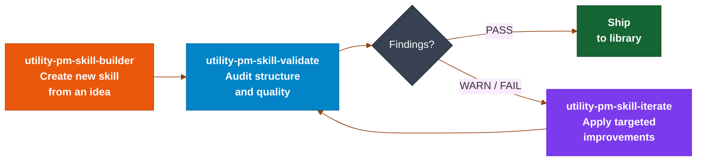

# product-on-purpose/pm-skills

> 暂无描述。

## 基本信息

| 字段 | 内容 |
|---|---|
| 名称 | product-on-purpose/pm-skills |
| 链接 | https://github.com/product-on-purpose/pm-skills |
| 来源聚合 | heilcheng/awesome-agent-skills |
| 分类路径 | 产品PM / 需求与PRD / 需求 |
| 类型 | AI Skill / Agent Tool |

## 简介

暂无简介。

## README / Skill 文档

<a id="readme-top"></a>

<h1>
  <a href="https://github.com/product-on-purpose/pm-skills">PM-Skills</a>
</h1>

<h4 >A curated library of 68 best-practice, plug-and-play product management skills covering the complete product lifecycle - plus templates, workflows, and 200+ real-world sample outputs that set the quality bar.</h4>

<p>
  <a href="https://github.com/product-on-purpose/pm-skills/issues/new?labels=bug">Report a Bug</a>
  ·
  <a href="https://github.com/product-on-purpose/pm-skills/issues/new?labels=enhancement">Request a Feature</a>
  ·
  <a href="https://github.com/product-on-purpose/pm-skills/discussions">Ask a Question</a>
</p>

<p>
  
  <a href="https://github.com/product-on-purpose/pm-skills/blob/main/LICENSE">
    
  </a>
  <a href="https://github.com/product-on-purpose/pm-skills/releases">
<!-- pmskills:version-badge:start (generated by scripts/gen-derived-surfaces.mjs; edit .claude-plugin/plugin.json, not this block) -->
    
<!-- pmskills:version-badge:end -->
  </a>
  <a href="#the-skill-library">
    
  </a>
  <a href="https://agentskills.io/specification">
    
  </a>
  <a href="https://skills.sh/product-on-purpose/pm-skills">
    
  </a>
  <a href="CONTRIBUTING.md">
    
  </a>
</p>

<p>
  <a href="https://github.com/product-on-purpose/pm-skills/stargazers">
    
  </a>
  <a href="https://github.com/product-on-purpose/pm-skills/network/members">
    
  </a>
  <a href="https://github.com/product-on-purpose/pm-skills/issues">
    
  </a>
  <a href="https://github.com/product-on-purpose/pm-skills/graphs/contributors">
    
  </a>
  <a href="https://github.com/product-on-purpose/pm-skills/commits/main">
    
  </a>
</p>

<p>
  <a href="https://github.com/product-on-purpose/pm-skills-mcp">
    
  </a>
</p>

<p>
  <a href="#the-big-idea">About</a> •
  <a href="#installation-and-setup">Install</a> •
  <a href="#the-skill-library">Skills</a> •
  <a href="#sub-agents">Sub-Agents</a> •
  <a href="#workflows">Workflows</a> •
  <a href="#learning-and-resources">Learning</a> •
  <a href="#project-status">Status</a> •
  <a href="#contributing">Contributing</a> •
  <a href="#community">Community</a>
</p>

---

<details>
<summary><strong>Table of Contents</strong></summary>

- [Quick Start](#quick-start)
- [Recent Updates](#recent-updates)
- [The Big Idea](#the-big-idea)
    - [Who Is This For](#who-is-this-for)
    - [Key Features](#key-features)
    - [Skill Lifecycle Tools](#skill-lifecycle-tools--custom-skill-builder)
    - [Founded On](#founded-on)
- [Installation and Setup](#installation-and-setup)
- [How Agent Skills Work](#how-agent-skills-work)
- [The Skill Library](#the-skill-library)
    - [Foundation Skills](#foundation-skills---cross-cutting-capability-11)
    - [Discover Phase Skills](#discover---find-and-assess-the-right-problem-5)
    - [Define Phase Skills](#define---frame-the-problem-5)
    - [Develop Phase Skills](#develop---explore-solutions-4)
    - [Deliver Phase Skills](#deliver---ship-it-6)
    - [Measure Phase Skills](#measure---validate-with-data-6)
    - [Iterate Phase Skills](#iterate---learn-and-improve-4)
    - [Tool Family: Foundation Sprint](#tool-family-foundation-sprint-7)
    - [Tool Family: Design Sprint](#tool-family-design-sprint-7)
    - [Standalone Tool Skill](#standalone-tool-skill)
    - [Utility Skills](#utility-skills---meta-tooling-12)
    - [Sub-Agents](#sub-agents)
    - [Workflows](#workflows-skill-chaining)
- [Library Examples](#library-examples)
- [Learning and Resources](#learning-and-resources)
- [Project Status](#project-status)
- [Contributing](#contributing)
- [Community](#community)
- [FAQ](#faq)
- [About the Author](#about-the-author)

</details>

---

## Quick Start

After installing, you'll have all 68 skills available (invoke any by name, like `/pm-skills:deliver-prd`, `/pm-skills:define-hypothesis`, `/pm-skills:deliver-user-stories`) plus 10 `/workflow-*` orchestrator commands and the `/chain` ad-hoc runner, templates, sub-agents, and 200+ sample outputs.

**Claude Code (recommended):**

```bash
/plugin marketplace add product-on-purpose/agent-plugins
/plugin install pm-skills@product-on-purpose
```

> Already installed via the old `pm-skills-marketplace`? It keeps working - no action needed. To move to the new home, see the [v2.21.0 release notes](https://github.com/product-on-purpose/pm-skills/releases/tag/v2.21.0).

**Cross-agent (Cursor, Copilot, Cline, and others via the open [skills CLI](https://github.com/vercel-labs/skills)):**

```bash
npx skills add product-on-purpose/pm-skills
```

**Clone or download:**

```bash
git clone https://github.com/product-on-purpose/pm-skills.git
```

[](https://github.com/product-on-purpose/pm-skills/releases/latest)

**More resources:**

- [Getting Started Guide](https://product-on-purpose.github.io/pm-skills/getting-started/) - Detailed walkthrough for new users covering clone, sync helper, and first skill run. The path to take if any of the quick start steps above leave gaps.
- [Setup by Platform](https://product-on-purpose.github.io/pm-skills/getting-started/platforms/) - Step-by-step install for Claude.ai, Codex, Cursor, Windsurf, GitHub Copilot, VS Code extensions, and ChatGPT.
- [Quickstart Reference](https://product-on-purpose.github.io/pm-skills/getting-started/quickstart/) - Short-form reference card for users who just need the commands.

<p align="right">(<a href="#readme-top">back to top</a>)</p>

---

## Recent Updates

<details>
<summary><strong>MCP Server: Maintenance Mode (effective 2026-05-04)</strong></summary>

The companion [`pm-skills-mcp`](https://github.com/product-on-purpose/pm-skills-mcp) server is in the v2.9.x maintenance line (latest v2.9.3) and remains available on npm for clients that need MCP transport. The catalog is frozen at the v2.9.2 build; subsequent v2.9.x patches do not change the catalog. Active development on the MCP server is paused; security patches and critical bug fixes will continue.

> **Recommendation:** For new users, we recommend using the plugin. See [Installation and Setup](#installation-and-setup) for other options.


</details>

---

**What's New**

<!-- pmskills:latest-release:start (generated by scripts/gen-derived-surfaces.mjs; edit CHANGELOG.md, not this block) -->
<!-- count-exempt:start -->

| Version | Date | Highlights |
| ------- | ---- | ---------- |
| [v2.31.1](https://github.com/product-on-purpose/pm-skills/releases/tag/v2.31.1) | 2026-07-31 | Maintenance patch: merge-pipeline trust repair and a security-queue drain. See [CHANGELOG](CHANGELOG.md#2311---2026-07-31). |
| [v2.31.0](https://github.com/product-on-purpose/pm-skills/releases/tag/v2.31.0) | 2026-07-05 | Zero-drift releases: generation becomes the only write path. See [CHANGELOG](CHANGELOG.md#2310---2026-07-05). |
| [v2.30.0](https://github.com/product-on-purpose/pm-skills/releases/tag/v2.30.0) | 2026-07-04 | Trust repair + hygiene. See [CHANGELOG](CHANGELOG.md#2300---2026-07-04). |

Full history: [CHANGELOG.md](CHANGELOG.md) or [all GitHub Releases](https://github.com/product-on-purpose/pm-skills/releases).

<!-- count-exempt:end -->
<!-- pmskills:latest-release:end -->

<p align="right">(<a href="#readme-top">back to top</a>)</p>

---

## The Big Idea

**Stop prompt-fumbling. Start shipping.** Every time you ask an AI to help with product management, you start from zero. Generic responses. Inconsistent formats. Missing critical sections. Hours lost to repetitive prompt crafting.

PM-Skills gives your AI instant access to professional frameworks refined across hundreds of product launches, production-ready templates that capture institutional PM knowledge, and real-world examples that set the quality bar.

| Without PM-Skills                 | With PM-Skills                  |
| --------------------------------- | ------------------------------- |
| ⚠️ Generic AI responses          | ✅ Professional PM frameworks   |
| ⚠️ Inconsistent formats          | ✅ Production-ready templates   |
| ⚠️ Missing key sections          | ✅ Comprehensive coverage       |
| ⚠️ Starting from scratch         | ✅ Building on best practices   |
| ⚠️ Prompt engineering every time | ✅ One command, instant results |

### Who Is This For

| You are...                            | PM-Skills gives you...                                                                      |
| ------------------------------------- | ------------------------------------------------------------------------------------------- |
| A solo PM using AI for the first time | A starting point that skips prompt engineering and produces professional output immediately |
| A team lead standardizing PM output   | Shared skill library your whole team invokes the same way, producing consistent artifacts   |
| An AI/PM builder creating PM tools    | Open-source, Apache 2.0 library of production-quality PM artifacts to build on              |

### Key Features

- ✅ **68 Production-Ready Skills** covering the complete product lifecycle (30 phase skills + 11 foundation skills + 12 utility skills + 15 tool skills for structured workshop methodologies)
- ✅ **Triple Diamond Framework** organizing Discover, Define, Develop, Deliver, Measure, and Iterate phases
- ✅ **Tool Families** for the Foundation Sprint (2-day strategic alignment) and Design Sprint (5-day prototype-and-test) workshop methodologies
- ✅ **5 Active Orchestration Sub-Agents** (pm-critic, pm-skill-auditor, pm-changelog-curator, pm-release-conductor, pm-workflow-orchestrator) for Claude Code, with dispatch skills extending the pattern to Codex, Cursor, Windsurf, Copilot, and Gemini CLI
- ✅ **12 Workflows** for common PM processes including Feature Kickoff, Lean Startup, Triple Diamond, and foundation-to-design end-to-end arc
- ✅ **10 Workflow Commands** for Claude Code users - plus every skill invocable directly by name
- ✅ **Auto-Discovery** via AGENTS.md in GitHub Copilot, Cursor, and Windsurf
- ✅ **Agent Skills Spec** compliant - works across AI assistants
- ✅ **Apache 2.0 Licensed** for commercial and personal use

### Skill Lifecycle Tools = Custom Skill Builder

PM-Skills includes three utility skills that form a complete **Create - Validate - Iterate** lifecycle for building and managing skills:



**Why this matters:** Skills are living artifacts that evolve. The builder creates them, the validator catches drift and quality gaps, and the iterator applies fixes. Together they keep the library consistent as it grows.

| Tool & Command                      | What it does                                                                                         |
| ----------------------------------- | ---------------------------------------------------------------------------------------------------- |
| **Builder:** `/pm-skills:utility-pm-skill-builder`    | Creates a new skill from an idea. Runs gap analysis against existing skills, classifies by type and phase, generates draft files to a staging area, and promotes on confirmation. |
| **Validator:** `/pm-skills:utility-pm-skill-validate` | Audits an existing skill against structural conventions and quality criteria. Produces a report with severity-graded findings and actionable recommendations. |
| **Iterator:** `/pm-skills:utility-pm-skill-iterate`   | Applies targeted improvements to a skill based on feedback or a validation report. Previews changes, writes on confirmation, and suggests a version bump. |

🔗 **More resources:**

- [**PM Skill Lifecycle Guide**](https://product-on-purpose.github.io/pm-skills/guides/pm-skill-lifecycle/) - Full workflow for creating, validating, and iterating skills, including the builder-validator-iterator cycle with worked examples.
- [**Creating PM Skills**](https://product-on-purpose.github.io/pm-skills/guides/creating-pm-skills/) - Authoring guide for contributing new skills to the library.
- [**Skill Template**](docs/templates/skill-template/) - The canonical three-file template every skill must follow; copy this as your starting point.

### Founded On

- **[Triple Diamond Framework](https://medium.com/zendesk-creative-blog/the-zendesk-triple-diamond-process-fd857a11c179)** - Six-phase product cycle (extends Design Council's Double Diamond): Discover, Define, Develop, Deliver, Measure, Iterate
- **[Opportunity Solution Trees](https://www.producttalk.org/opportunity-solution-tree/) (Teresa Torres)** - Outcome-driven discovery
- **[Jobs to be Done Framework](https://strategyn.com/jobs-to-be-done/)** - Customer motivation framework
- **[Foundation Sprint](https://thefoundationsprint.com/) 

> *（内容过长，已截断前 15000 字符。完整文档见原链接）*

## 参考链接

- https://github.com/product-on-purpose/pm-skills
