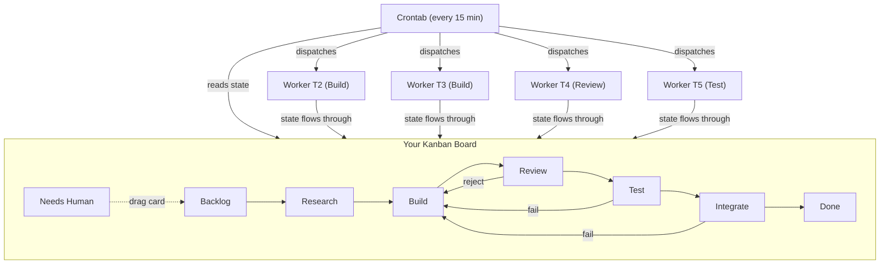
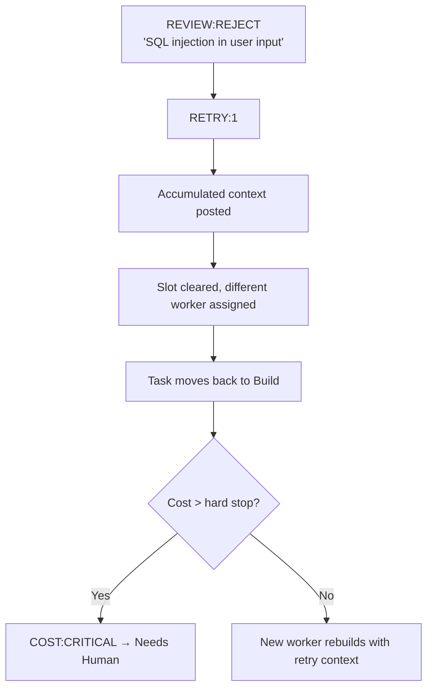
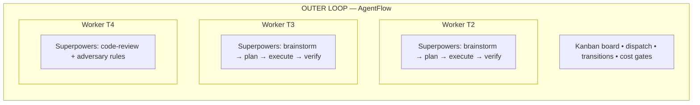

# urrhb/agentflow

> 暂无描述。

## 基本信息

| 字段 | 内容 |
|---|---|
| 名称 | urrhb/agentflow |
| 链接 | https://github.com/UrRhb/agentflow |
| 来源聚合 | sickn33/agentic-awesome-skills |
| 分类路径 | 开发工程 / 工程方法 / 通用工程 |
| 类型 | AI Skill / Agent Tool |

## 简介

暂无简介。

## README / Skill 文档

<p align="center">
  <h1 align="center">AgentFlow</h1>
  <p align="center"><strong>Your Kanban board builds your code.</strong></p>
  <p align="center">
    The first AI development pipeline that uses your project management tool as the orchestration layer.<br/>
    Full observability. Deterministic quality gates. Zero custom infrastructure.
  </p>
  <p align="center">
    <a href="#quick-start">Quick Start</a> &bull;
    <a href="docs/architecture.md">Architecture</a> &bull;
    <a href="docs/getting-started.md">Getting Started</a> &bull;
    <a href="docs/gap-registry.md">Gap Registry</a> &bull;
    <a href="#comparison">Comparison</a>
  </p>
  <p align="center">
    <a href="LICENSE"></a>
    <a href="https://github.com/UrRhb/agentflow/stargazers"></a>
    
    
  </p>
</p>

---

## What is AgentFlow?

AgentFlow turns your existing Kanban board (Asana, GitHub Projects, Linear, Jira) into a **fully autonomous AI development pipeline**. Instead of building custom orchestration infrastructure, AgentFlow treats your project management tool as a distributed state machine — tasks move through stages, AI agents read and write state via comments, and humans intervene through the same UI they already use.

**The result:** Complete pipeline observability from your phone. Crash recovery for free (state lives in your PM tool, not in memory). Human override at any point by dragging a card.

### Why AgentFlow?

Most AI coding tools either give you a chatbot or a black-box agent. AgentFlow gives you a **visible, auditable pipeline** where:

- Every decision is a comment on a task card
- Every stage transition is a card moving between columns
- Every retry carries accumulated context from previous attempts
- Every cost is tracked per-task with automatic guardrails
- Every failure pattern is captured and fed back into the system

You don't need to trust a black box. Open your Kanban board and watch the pipeline work.

## Key Features

### Pipeline Orchestration
- **7-stage Kanban pipeline**: Backlog → Research → Build → Review → Test → Integrate → Done
- **Stateless orchestrator**: One-shot sweep via crontab — no daemon, no session dependency, crash-proof
- **Transitive priority dispatch**: Tasks that unblock the most work get built first (automatic critical path)
- **Conflict-aware scheduling**: Parallel tasks touching the same files are serialized automatically

### Quality Gates
- **Deterministic before probabilistic**: `tsc + eslint + tests` run as hard gates before any AI review — catches ~60% of issues at near-zero cost
- **Adversarial AI review**: Reviewers must "list 3 things wrong before deciding to pass"
- **Coverage gate**: 80% threshold on new files before promotion to Test stage
- **Integration testing**: Full suite runs on `main` after every merge — auto-reverts on failure

### Observability & Cost Tracking
- **Full pipeline observability** from your phone — every task card shows current stage, assigned agent, retry count, and accumulated cost
- **Per-task cost tracking** with stage cost ceilings (Sonnet default: Research ~$0.10, Build ~$0.40, Review ~$0.10, Test ~$0.05, Integrate ~$0.03)
- **Automatic cost guardrails**: Warning at $3/$8, hard stop at $10/$20 (Sonnet/Opus) with human escalation
- **Real-time status dashboard** pinned to each project
- **Heartbeat monitoring**: Dead agents detected and reassigned within 10 minutes

### System Learning
- **Feedback loops with accumulated context**: Every retry carries what was tried, what failed, and what to do differently
- **System-level retrospectives**: Every 10 completed tasks, common failure patterns are extracted to `LEARNINGS.md`
- **Cross-task learning**: Builders and reviewers read `LEARNINGS.md` before starting work
- **Spec drift detection**: SHA-256 hash comparison catches requirement changes mid-sprint

### Safety & Recovery
- **Auto-revert on integration failure**: `git revert` (new commit, never force-push)
- **Graceful shutdown**: Active workers finish, unstarted tasks return to backlog
- **Blocked task detection**: After 2 failed attempts, tasks escalate to human review
- **Scope creep detection**: PR diff files compared against predicted files list
- **Secret management**: Mock values in tests, environment variables in code, manual verification flags for real API tasks

## Architecture



**Core principle:** The Kanban board IS the orchestration layer. No separate database, no message queue, no custom infrastructure. State lives where humans already look.

[Full architecture docs →](docs/architecture.md)

## Quick Start

### Prerequisites

- [Claude Code](https://claude.ai/code) (CLI)
- An Asana workspace with MCP integration (or GitHub Projects — adapter coming soon)
- Git + Node.js project

### Installation

```bash
# Clone the repo
git clone https://github.com/UrRhb/agentflow.git

# Copy skills and prompts to your Claude Code config
cp -r agentflow/skills/* ~/.claude/skills/
cp -r agentflow/prompts/* ~/.claude/sdlc/prompts/
cp agentflow/conventions.md ~/.claude/sdlc/conventions.md
```

### Plugin Installation (Recommended)

If you're using Claude Code, install AgentFlow as a native plugin for automatic worker spawning, instant handoffs, and infrastructure-level quality gates:

```bash
# Add the AgentFlow marketplace
claude plugin marketplace add UrRhb/agentflow

# Install the plugin
claude plugin install agentflow

# Or manually:
git clone https://github.com/UrRhb/agentflow.git
cd agentflow && ./setup.sh
```

**Plugin mode gives you:**
- Automatic worker spawning (no iTerm tabs)
- Instant handoffs via SendMessage (seconds, not 15 minutes)
- Infrastructure-level quality gates (hooks enforce tsc/lint/test/coverage)
- Real-time progress tracking
- Clean team shutdown

**Quick start (plugin mode):**
```bash
# 1. Create your spec
# 2. Decompose into tasks
claude -p "/spec-to-board"

# 3. Start the pipeline (workers spawn automatically!)
claude -p "/sdlc-orchestrate"

# 4. Watch from your phone (Asana) or terminal
claude -p "/sdlc-health"
```

### Setup

**1. Create your spec**

Write a `SPEC.md` for your project — or use Claude to brainstorm one:

```
You: I want to build [your idea]
Claude: [brainstorms → produces SPEC.md]
```

**2. Decompose into tasks**

```
You: /spec-to-asana
Claude: Reading SPEC.md... Decomposing into atomic tasks...
        Created 14 tasks across 3 sub-phases in Asana.
        Dependencies mapped. Ready to build.
```

**3. Start workers**

Open 3-4 terminal windows, each as a worker slot:

```bash
# Terminal 2
claude -p "/sdlc-worker --slot T2"

# Terminal 3
claude -p "/sdlc-worker --slot T3"

# Terminal 4 (reviewer)
claude -p "/sdlc-worker --slot T4"

# Terminal 5 (tester)
claude -p "/sdlc-worker --slot T5"
```

**4. Start the orchestrator**

```bash
# Add to crontab (runs every 15 minutes)
crontab -e
# Add: */15 * * * * ~/.claude/sdlc/agentflow-cron.sh >> /tmp/agentflow-orchestrate.log 2>&1
```

**5. Watch from your phone**

Open Asana on your phone. Watch tasks flow through the pipeline. Drag any card to "Needs Human" to intervene.

### Stop the pipeline

```
You: /sdlc-stop
Claude: Graceful shutdown initiated. Active workers finishing...
        3 tasks returned to Backlog. System paused.
```

[Detailed getting started guide →](docs/getting-started.md)

## How It Works

### The 7-Stage Pipeline

| Stage | What Happens | Gate |
|-------|-------------|------|
| **Backlog** | Task waiting for dependencies + available slot | Dependencies resolved, no file conflicts |
| **Research** | Conditional — only runs if task has research triggers | Structured findings posted |
| **Build** | AI writes code, creates PR | `tsc + eslint + npm test` (deterministic) |
| **Review** | Different AI agent reviews adversarially | Must list 3 issues before passing |
| **Test** | Full test suite + visual validation + coverage check | 80% coverage on new files |
| **Integrate** | Merge to main, run full suite | All tests pass on main |
| **Done** | Task complete | — |

### Task Lifecycle

```mermaid
graph LR
    A["[SLOT:--] Backlog"] -->|assign T2| B["[SLOT:T2] Build"]
    B -->|"PR created"| C["Lint Gate: tsc + eslint + tests"]
    C -->|LINT:PASS| D["Review (T4)"]
    D -->|"3 issues, all minor"| E["Coverage Gate"]
    E -->|COV:PASS| F["Test (T5)"]
    F -->|TEST:PASS| G["Merge PR"]
    G --> H["Integration Check"]
    H -->|INTEGRATE:PASS| I["Done [$5.75]"]
```



### What Happens When Things Fail



## Comparison

<a id="comparison"></a>

| Feature | **AgentFlow** | GSD | Superpowers | Aperant |
|---------|:------------:|:---:|:-----------:|:-------:|
| **Orchestration layer** | Your Kanban board (Asana/Linear/Jira) | CLI waves | CLAUDE.md prompts | Electron app |
| **Pipeline observability** | Full (phone, web, desktop) | Terminal only | File-based | Desktop app |
| **Deterministic quality gates** | tsc + lint + tests before AI review | None | None | None |
| **Per-task cost tracking** | Built-in with guardrails | None | None | None |
| **Adversarial review** | Different agent, must find 3 issues | Same agent | Same agent | Same agent |
| **Integration testing** | Auto-revert on main breakage | None | None | None |
| **System-level learning** | LEARNINGS.md retrospectives | None | None | None |
| **Crash recovery** | Free (state in PM tool) | Restart from scratch | Re-read files | Restart app |
| **Human intervention** | Drag a card | Kill process | Edit files | Click button |
| **Spec drift detection** | SHA-256 hash comparison | None | None | None |
| **Multi-project support** | Native (portfolio view) | Single project | Single project | Single project |
| **Parallel agents** | 4+ workers with conflict detection | Wave-based | Sequential | Sequential |
| **Custom infrastructure** | None (uses existing PM tool) | CLI tool | Markdown files | Electron + SQLite |
| **Adapter ecosystem** | Asana, GitHub Projects (planned), Linear (planned) | GitHub only | Any git repo | Local only |
| **Worker spawning** | Automatic (plugin) or manual (standalone) | Manual | Manual | Manual |

### When to Use What

- **AgentFlow**: You want full pipeline observability, deterministic quality gates, cost tracking, and the ability to monitor/intervene from your phone. Best for teams and solo devs running multiple projects.
- **AgentFlow + Superpowers**: You want the best of both — AgentFlow orchestrates across tasks, Superpowers optimizes each worker's methodology. [See integration guide below.](#superpowers-integration)
- **GSD**: You want a simple CLI tool for wave-based task execution. Good for quick prototyping.
- **Superpowers**: You want a methodology-as-prompt approach with minimal setup. Good for single-project focus.
- **Aperant**: You want a desktop GUI for agent management. Good for visual workflow preference.

## Superpowers Integration

<a id="superpowers-integration"></a>

AgentFlow and [Superpowers](https://github.com/obra/superpowers) operate at **different layers** and are designed to stack:



**AgentFlow** decides: *"Task APP-007 goes to Worker T2 now"*
**Superpowers** decides: *"Inside T2, I'll brainstorm → plan → execute with sub-agents → verify"*

### What Each Layer Controls

| Concern | AgentFlow (outer) | Superpowers (inner) |
|---------|-------------------|-------------------|
| Task assignment | Which worker gets which task | — |
| Build methodology | Lifecycle markers + heartbeats | brainstorm → plan → execute → verify |
| Parallelism | Across tasks (T2 builds one, T3 builds another) | Within a task (sub-agents write code in parallel) |
| Quality gates | Deterministic (tsc/lint/test) + adversarial review | Structured review methodology |
| Debugging | Retry context + worker rotation | Systematic debugging methodology |
| Cost tracking | Per-task with guardrails | — |

### Complexity Gating

Not every task needs Superpowers' full methodology. AgentFlow gates by task complexity:

| Complexity | Superpowers Methodology | Why |
|-----------|------------------------|-----|
| **S** (Simple, <30min) | Skip brainstorm + plan. Direct build. | Overkill adds ~$0.50-1.00 for zero quality gain |
| **M** (Medium, <1hr) | Skip brainstorm. Use plan → execute. | Planning helps, brainstorming doesn't |
| **L** (Complex, <2hr) | Full: brainstorm → plan → execute → verify | Worth the investment on complex tasks |

### Integration Gaps (24-31)

Stacking two systems creates 8 new failure modes. All are addressed in AgentFlow's design:

| # | Gap | Fix |
|---|-----|-----|
| 24 | Context window war (both systems load large prompts) | Lazy-load: only load Superpowers prompts matching task complexity |
| 25 | Two captains (conflicting workflow control) | AgentFlow owns lifecycle, Superpowers owns methodology |
| 26 | Sub-agents skip heartbeats (false dead-worker detection) | Parent worker posts heartbeats independently of sub-agents |
| 27 | Plan exceeds task scope (Superpowers plans freely) | Feed predicted files + acceptance criteria as hard constraints |
| 28 | Double cost tracking (sub-agents add hidden cost) | Adjusted ceilings: S=$3, M=$5, L=$8 when Superpowers active |
| 29 | Retry context fragmentation (sub-agent failures los

> *（内容过长，已截断前 15000 字符。完整文档见原链接）*

## 参考链接

- https://github.com/UrRhb/agentflow
