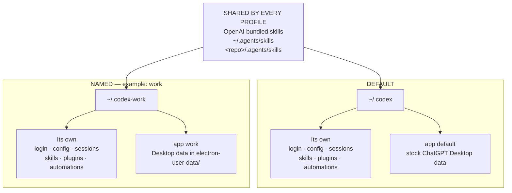

# ducksss/codex-profiles

> 暂无描述。

## 基本信息

| 字段 | 内容 |
|---|---|
| 名称 | ducksss/codex-profiles |
| 链接 | https://github.com/Ducksss/codex-profiles |
| 来源聚合 | sickn33/agentic-awesome-skills |
| 分类路径 | 开发工程 / 工程方法 / 通用工程 |
| 类型 | AI Skill / Agent Tool |

## 简介

暂无简介。

## README / Skill 文档

# codex-profiles

Named Codex homes and ChatGPT windows with separate local state, without
copying tokens.

[](https://github.com/Ducksss/codex-profiles/actions/workflows/ci.yml)
[](https://github.com/Ducksss/codex-profiles/releases)
[](https://www.npmjs.com/package/codex-profile)
[](LICENSE)
[](bin/codex-profile)
[](#platform-support)

[Project page](https://ducksss.github.io/codex-profiles/) |
[llms.txt](https://ducksss.github.io/codex-profiles/llms.txt) |
[Practical guides](#practical-guides) |
[Agent guide](AGENTS.md) |
[Security model](SECURITY.md)

`codex-profiles` is a dependency-free Bash wrapper for people who use Codex
with personal, work, school, client, or test accounts. Each name selects a
separate `CODEX_HOME`. On macOS, a named Desktop launch also selects separate
Electron user data for the whole launched ChatGPT window.

```sh
codex-profile cli personal                     # Codex CLI on personal
codex-profile cli work exec "review this repo" # one-shot Codex CLI on work
codex-profile app default ~/Dev/app             # stock ChatGPT session
codex-profile app work ~/Dev/client             # named work ChatGPT window
```

The project keeps its existing name and commands. Version 0.7 adapts the
implementation to OpenAI's integrated ChatGPT desktop app; it does not rebrand
the CLI or copy, parse, print, or migrate `auth.json`.

## Understand the two scopes first

[OpenAI's July 9 release notes](https://help.openai.com/en/articles/6825453-chatgpt-release-notes)
describe the integrated desktop app as bringing Chat, Work, and Codex together.
The commands in this project therefore have two intentionally different scopes:

| Command family | What the selected name controls |
| --- | --- |
| `cli`, `login`, `env`, `use` | Codex-local state under the selected `CODEX_HOME`. These commands do not switch an open ChatGPT window. |
| `app default` | The normal installed ChatGPT app, its stock Desktop session, and `~/.codex`. |
| `app <name>` | A named ChatGPT window with its own local Electron user data across Chat, Work, and Codex, plus `~/.codex-<name>` for Codex-local state. |
| `status` | Codex-local login status. It does not identify the account shown in a ChatGPT window. |
| `doctor` | Installation and local-state diagnostics. It cannot prove that CLI and Desktop are signed into the same account. |

`work` in `codex-profile app work` is a user-chosen profile name. It is not the
ChatGPT product mode named **Work**. Once a named window is open, switching its
mode between Chat, Work, and Codex stays inside that window's Desktop session.

Account equality is deliberately **unverified**. The tool does not inspect
tokens, account identifiers, cookies, or private application data. If you want
the CLI and Desktop window to use the same account, authenticate both in that
profile and verify the visible account yourself.

Local-state separation is not an account, OS, or server-side boundary.

## Install

With npm:

```sh
npm install -g codex-profile
```

The npm package is singular. It installs both `codex-profile` and
`codex-profiles`; the plural npm package belongs to another project.

With Homebrew:

```sh
brew install Ducksss/tap/codex-profile
```

With the standalone installer:

```sh
curl -fsSL https://raw.githubusercontent.com/Ducksss/codex-profiles/main/install.sh | sh
```

With Nix:

```sh
nix run github:Ducksss/codex-profiles
nix profile install github:Ducksss/codex-profiles
```

From source:

```sh
git clone https://github.com/Ducksss/codex-profiles.git
cd codex-profiles
make install
```

Then verify the installation:

```sh
codex-profile doctor
```

## Quick start

Create two Codex homes and authenticate their CLI sessions:

```sh
codex-profile init personal
codex-profile init work
codex-profile login personal
codex-profile login work
```

To keep authentication and runtime state separate while sharing selected
configuration, initialize a new linked profile from an existing one:

```sh
codex-profile init personal-2 --share-with personal
codex-profile login personal-2
```

Run the upstream Codex CLI with either home:

```sh
codex-profile cli personal
codex-profile cli work exec "run tests and summarize failures"
```

Optionally bind a project once, then let the current directory select its
profile for both CLI and Desktop launches:

```sh
codex-profile workspace bind ~/Dev/work-project work
cd ~/Dev/work-project
codex-profile run exec "run tests and summarize failures"
codex-profile run --app
```

On macOS, open the stock ChatGPT session or a named window with separate local
state:

```sh
codex-profile app default ~/Dev/main-project
codex-profile app personal ~/Dev/personal-project
codex-profile app work ~/Dev/work-project
```

The first launch of a named window may require signing into ChatGPT. Reopening
the same name reuses that name's Desktop process and data. Different names can
run side by side. The launcher uses the original signed `ChatGPT.app`; it does
not clone, patch, re-sign, quit, or replace the installed app.

## Practical guides

- [Use separate work and personal Codex CLI profiles](https://github.com/Ducksss/codex-profiles/discussions/28)
- [Open separate named ChatGPT windows on macOS](https://github.com/Ducksss/codex-profiles/discussions/29)
- [Understand what codex-profiles isolates and what remains shared](https://github.com/Ducksss/codex-profiles/discussions/30)

## How profiles map to disk

Only `default` is special:

```text
default  -> ~/.codex
<name>   -> ~/.codex-<name>
```

Examples:

```text
personal -> ~/.codex-personal
work     -> ~/.codex-work
edu      -> ~/.codex-edu
client   -> ~/.codex-client
```

Every launch picks one profile box. Shared skills are added to whichever box
you pick:



The two profile boxes are siblings: `work` does not inherit anything from
`default`. Only `init --share-with` creates the limited links documented below.

For a named Desktop launch, local Electron data lives below that profile home:

```text
~/.codex-<name>/electron-user-data
```

The directory supplies separate Electron state for that named ChatGPT window.
Local-state separation is not an account, OS, or server-side boundary. Profile
names must begin with a letter or number and may then contain letters, numbers,
dots, dashes, or underscores.

Inspect a path without creating or launching anything:

```sh
codex-profile path personal
```

## Common workflows

### Manage profiles

```sh
codex-profile init client-a
codex-profile init client-b --share-with client-a
codex-profile list
codex-profile remove client-a
codex-profile remove client-a --yes
```

`list` and `status` are read-only. They do not create a directory for a typo.
Removing a profile deletes its Codex home and, for a named Desktop profile, its
local Electron data. It also removes bindings that target that profile, without
deleting any project directory. Review the path and close the corresponding
window first.

### Bind projects to profiles

```sh
codex-profile workspace bind ~/Dev/client-a client-a
codex-profile workspace bind ~/Dev/client-a/service client-a-service
codex-profile workspace list
codex-profile workspace status
codex-profile workspace status --json ~/Dev/client-a/service
```

Bindings use physical canonical directory paths. The nearest bound ancestor
wins, so a nested project can override a broader workspace. Similar string
prefixes are not matches: binding `client-a` does not bind `client-app`.
Bindings are private local metadata; they do not create or modify files in a
project.

From a bound directory, omit the profile name:

```sh
codex-profile run
codex-profile run exec "review this repo"
codex-profile run -- --app            # pass --app to the upstream CLI
codex-profile run --app               # launch the bound ChatGPT window
codex-profile run --app ~/Dev/client-a
```

Explicit `cli`, `env`/`use`, and `app` selections are checked against the
current or supplied workspace. Mismatches warn on stderr by default, so stdout
remains safe for `eval` and scripts. Choose stricter or disabled checks with:

```sh
codex-profile workspace guard strict
codex-profile workspace guard off
codex-profile workspace guard warn
```

Strict mode rejects a mismatch before launching Codex, ChatGPT, or emitting
shell exports. This is a mistake-prevention guardrail, not a security boundary;
it can be disabled or bypassed by invoking upstream Codex directly. The wrapper
requires `--` before upstream options that start with a dash, for example
`codex-profile run -- -C <directory>`. Those arguments are passed through and
are not parsed for guard resolution, so change to the intended directory before
using `run` or an explicitly guarded `cli`.

Binding state is stored with private permissions in
`${XDG_CONFIG_HOME:-~/.config}/codex-profile/workspaces.tsv`; the guard setting
is stored beside it. `CODEX_PROFILE_CONFIG_HOME` overrides that directory for
automation. Bindings contain only canonical project paths and profile names,
never authentication, cookies, sessions, or credentials.

#### Share configuration, not identity or runtime state

`init <profile> --share-with <source-profile>` creates a new, private profile
directory and symlinks only source entries that already exist in this explicit
allowlist:

```text
config.toml
AGENTS.md
AGENTS.override.md
instructions.md
custom-instructions.md
rules/
plugins/
```

The target must not already exist. `auth.json`, `sessions/`, `logs/`,
`electron-user-data/`, caches, skills, and connector/app state are never
linked. The command does not read or copy authentication data. Allowlisted
links are live: edits from either profile affect the same source configuration,
and plugins or configuration can themselves contain sensitive or executable
content. Review the source before linking across trust domains.

### Inspect Codex-local status

```sh
codex-profile status
codex-profile status personal
codex-profile status --json
codex-profile doctor
codex-profile doctor --json
```

Status is about the Codex authentication associated with `CODEX_HOME`; it is
not a ChatGPT Desktop account inspector. Diagnostics must not be used to infer
that two sessions are the same account.

### Use the stock and named ChatGPT sessions

```sh
codex-profile app default
codex-profile app personal ~/Dev/personal-app
codex-profile app work ~/Dev/work-app
```

- `default` preserves the normal ChatGPT session and maps Codex state to
  `~/.codex`.
- Every other name receives its own Electron user-data directory and matching
  `CODEX_HOME`.
- The local boundary applies to the whole launched window: Chat and Work use
  its Electron context, while Codex also receives the matching `CODEX_HOME`.
  Account identity still must be verified in the relevant UI.
- Opening a named window never quits the stock window or another profile.

#### Deprecated compatibility spellings

The older spellings remain accepted for compatibility:

```sh
codex-profile app work --instance ~/Dev/work-app
codex-profile app work --instance --rebuild ~/Dev/work-app
codex-profile app-instance work ~/Dev/work-app
```

Named launches already use separate local state and can run in parallel, so
`--instance` and `app-instance` now mean the ordinary named launch. `--rebuild`
is accepted as a deprecated no-op because no app clone exists to rebuild. New
scripts should use `codex-profile app <name> [workspace]`.

### Read Desktop logs

```sh
codex-profile logs personal --path
codex-profile logs personal
codex-profile logs personal --tail 100
```

The deprecated `logs <name> --instance` spelling remains available for older
scripts and installations. It reads the canonical `desktop.log` when present,
then falls back to a pre-v0.7 `desktop-instance.log`.

### Clean up pre-v0.7 app clones

`codex-profile doctor` reports the legacy clone root when it exists. Version
0.7 never launches or modifies those bundles. After closing every old cloned
app and reviewing the path, remove only that obsolete clone directory:

```sh
rm -rf "$HOME/Library/Application Support/codex-profile/app-instances"
```

This does not remove named `CODEX_HOME` or `electron-user-data` directories;
use `codex-profile remove <name>` when you intentionally want to delete those.

### Activate a Codex home in the current shell

`env` prints shell code; it does not launch or switch ChatGPT Desktop:

```sh
eval "$(codex-profile env work)"
codex
codex exec "run tests"
```

For the shorter `use` command, install the shell wrapper once:

```sh
# bash or zsh
eval "$(codex-profile shell-init zsh)"

# fish
codex-profile shell-init fish | source
```

Then:

```sh
codex-profile use work
```

Activation exports functional `CODEX_HOME` and informational
`CODEX_PROFILE_NAME`. It affects subsequent Codex CLI commands in that shell,
not an existing ChatGPT window. Open a new shell or unset both variables to
deactivate.

### Copy known non-secret configuration

```sh
codex-profile clone-config personal work
codex-profile clone-config personal work --force
```

Only root-level `config.toml` and `AGENTS.md` are eligible. The command never
copies `auth.json`, sessions, plugins, logs, caches, Electron data, or
directories, and it refuses sensitive-looking configuration keys.

### Upgrade a source installation

```sh
codex-profile upgrade --dry-run
codex-profile upgrade
codex-profile upgrade --prefix /usr/local
codex-profile upgrade --ref v0.8.0
```

The default checkout is cached under `~/.cache/codex-profile/source`. Review a
dry run before pointing upgrade at a non-default repository or ref. Package
manager installations should normally be upgraded with that package manager.

## Shell completions

```sh
codex-profile completions bash
codex-profile completions zsh
codex-profile completions fish
```

For Bash, sa

> *（内容过长，已截断前 15000 字符。完整文档见原链接）*

## 参考链接

- https://github.com/Ducksss/codex-profiles
