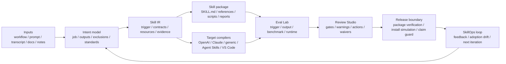

# yaojingang/yao-meta-skill

> 暂无描述。

## 基本信息

| 字段 | 内容 |
|---|---|
| 名称 | yaojingang/yao-meta-skill |
| 链接 | https://github.com/yaojingang/yao-meta-skill |
| 来源聚合 | sickn33/agentic-awesome-skills |
| 分类路径 | AIGC创作 / 生图 / 文生图T2I |
| 类型 | AI Skill / Agent Tool |

## 简介

暂无简介。

## README / Skill 文档

# Yao Meta Skill

[](https://github.com/yaojingang/yao-meta-skill/actions/workflows/test.yml)
[](LICENSE)
[](README.md)
[](docs/README.zh-CN.md)
[](docs/README.ja-JP.md)
[](docs/README.fr-FR.md)
[](docs/README.ru-RU.md)

`YAO` stands for `Yielding AI Outcomes`: the goal is not to generate more prompt text, but to produce reusable AI assets and real operational outcomes.

`yao-meta-skill` creates, evaluates, packages, and governs reusable agent skills. The 1.0 line focused on turning repeated workflows into installable, readable, cross-platform skill packages. The 2.0 line expands that factory into a Skill OS: a governed system for modeling a skill once, compiling it for multiple targets, testing its behavior, reviewing its release evidence, and tracking the next iteration.

[Quick Start](#quick-start) · [Skill OS 2.0](#skill-os-20-upgrade) · [1.0 vs 2.0](#from-10-to-20) · [Operator UX](#operator-ux-commands) · [Benchmark](#weighted-quality-benchmark) · [Examples](examples/README.md) · [Evals](evals/README.md) · [Failure Library](failures/README.md) · [Method Doctrine](#method-doctrine)

## Skill OS 2.0 Upgrade

Skill OS 2.0 keeps the original promise of `yao-meta-skill`, but makes the package lifecycle more explicit. Instead of stopping at `SKILL.md`, it adds a semantic contract, target compilers, evaluation evidence, release gates, and operation reports around the skill.

- **Skill IR**: a platform-neutral intermediate representation for intent, triggers, inputs, outputs, boundaries, references, and expected artifacts.
- **Target compilers and adapters**: generated surfaces for OpenAI, Claude, generic agent skills, Agent Skills compatible packages, and VS Code-oriented workflows.
- **Output Eval Lab**: trigger checks, output assertions, execution evidence, timing and token evidence, benchmark reproducibility, blind-review packs, answer keys, and adjudication reports.
- **Review Studio 2.0**: a single HTML gate page for intent, triggers, output eval, context cost, runtime checks, trust, Skill Atlas signals, adoption drift, waivers, annotations, release evidence, warnings, blockers, and fix actions.
- **Evidence and release governance**: evidence consistency checks, package verification, install simulation, runtime permission probes, world-class evidence intake, world-class ledger, operator runbook, and public claim guard.
- **SkillOps loop**: metadata-only adoption drift, telemetry hooks, adaptive proposals, daily and weekly curator reports, and portfolio-level drift signals.

Current posture: the repository is ready for beta and external testing, while stronger public "world-class" claims remain evidence-gated. Provider-backed production evidence, human blind-review evidence, native permission execution, and real-client telemetry are tracked as separate evidence tasks instead of being treated as completed work.

See the companion artifacts:

- [Visual 1.0 vs 2.0 comparison report](.previews/yao-meta-skill-2-comparison/index.html)
- [Chinese desktop preview](.previews/yao-meta-skill-2-comparison/yao-meta-skill-1-vs-2.png)
- [English desktop preview](.previews/yao-meta-skill-2-comparison/yao-meta-skill-1-vs-2-en.png)

## From 1.0 to 2.0

| Dimension | 1.0 focus | 2.0 upgrade |
| --- | --- | --- |
| Product role | Create, refactor, evaluate, and package reusable skills. | Govern the full lifecycle of a skill: creation, compilation, evaluation, review, release, telemetry, and iteration. |
| Architecture | `SKILL.md`, `agents/interface.yaml`, manifest files, and report artifacts. | Skill IR, target compilers, adapters, gate contracts, evidence ledgers, release locks, and action-oriented review pages. |
| Cross-platform delivery | OpenAI, Claude, and generic package targets. | Adds broader Agent Skills and VS Code-oriented compatibility, with registry-readable compatibility records. |
| Quality model | Trigger and structure checks plus report-based review. | Output eval, benchmark reproducibility, execution evidence, failure disclosure, blind-review packs, and evidence consistency checks. |
| Report experience | Overview HTML and first-pass review pages. | Bilingual Skill Overview v2, Review Studio 2.0, reviewer annotations, action cards, charts, and audit-oriented report contracts. |
| Release boundary | Package output with basic validation. | Package verification, install simulation, runtime permission probes, release locks, public claim guard, and operator runbooks. |
| Operating loop | Manual feedback and local iteration. | Adoption drift, metadata telemetry, SkillOps reports, adaptive proposals, and portfolio-level drift detection. |

## 2.0 Use Cases

- **Create a new skill from repeated work**: start with a workflow note, prompt set, transcript, runbook, or document pattern, then generate a package with a lean entrypoint, explicit inputs and outputs, references, reports, and the lightest justified gates.
- **Upgrade a personal skill into a team asset**: add interface contracts, manifests, target adapters, trust checks, output evals, reviewer waivers, release notes, and Review Studio evidence before other people depend on the skill.
- **Prepare a skill for beta release**: run package verification, install simulation, compatibility checks, runtime permission probes, and evidence consistency checks, then separate beta readiness from stronger public claims.
- **Keep a skill useful after release**: use metadata-only telemetry, adoption drift, feedback logs, SkillOps reports, and adaptive proposals to decide whether the next move should be documentation, an eval, a skill patch, or a governance update.
- **Compare with other meta-skill approaches**: keep Anthropic/OpenAI-style conversational creation and lean instruction writing where they fit, then use `yao-meta-skill` when the package needs evidence, portability, release gates, and repeatable maintenance.

## Operator UX Commands

These read-only helper commands turn common maintainer questions into repeatable diagnostics:

```bash
python3 scripts/yao.py install-status --expected-source .
python3 scripts/yao.py localized-doc-sync-check
python3 scripts/yao.py pr-review-report 4 --repo yaojingang/yao-meta-skill
```

- `install-status` explains whether the active skill is coming from `.codex/skills`, `.agents/skills`, or the disabled mirror, and flags duplicate active installs.
- `localized-doc-sync-check` verifies that the Chinese README carries the public homepage sections that were added to the English README.
- `pr-review-report` reads GitHub PR metadata, changed files, status checks, and suggested local commands without merging or mutating the PR.

## Capability Surface

It turns rough workflows, transcripts, prompts, notes, and runbooks into reusable skill packages with:

- a clear trigger surface
- a lean `SKILL.md`
- optional references, scripts, and evals
- a front-loaded intent dialogue with an intent confidence gate, so the system keeps clarifying when the true job, outputs, exclusions, or standards are still fuzzy
- a silent-by-default GitHub benchmark scan plus reference synthesis that studies top public repositories and world-class pattern tracks, then surfaces only real conflicts or uncertainty to the user
- a generated visual HTML overview for each newly initialized skill
- a Review Studio 2.0 HTML gate page that combines intent, trigger, output eval, context, runtime, trust, atlas, adoption drift, reviewer waivers, reviewer annotations, release evidence, and per-warning fix actions
- a Skill OS 2.0 audit that maps each world-class requirement to current evidence, human-required gaps, and external-required gaps
- a Skill OS 2.0 blueprint coverage report that maps the upgrade plan's core modules and recommended PRs to concrete artifacts, commands, and tests
- a world-class evidence plan that turns remaining provider, human, native-permission, and real-client telemetry gaps into executable evidence tasks
- a world-class evidence ledger that records which external and human evidence is accepted or still pending without treating planned work as proof
- a world-class evidence intake contract that validates external and human evidence packets for provenance, privacy, artifact refs, and anti-overclaim rules before ledger review
- a redacted world-class preflight report that checks local files, environment readiness, human/external prerequisites, and source blockers before operators collect evidence
- a world-class submission review queue that compares evidence packets, intake validation, source artifacts, and ledger state without accepting evidence
- a world-class operator runbook that gives reviewers the exact commands, artifacts, and collection checklist needed to close remaining evidence gaps
- a world-class claim guard that scans public claim surfaces and blocks premature completed/true claims while the evidence ledger still has pending external or human evidence
- a benchmark reproducibility manifest that checks methodology sections, required artifacts, failure disclosure, and reproduction commands
- an evidence consistency gate that compares generated reports against each other so benchmark, overview, interpretation, adoption, world-class ledger, coverage, and Review Studio facts do not drift silently
- Output Eval Lab evidence with assertion grading, execution/timing/token evidence, a blind A/B review pack, a separate answer key, and reviewer adjudication reports
- a runtime permission probe report that checks packaged target adapters for explicit permission metadata, native-enforcement flags, metadata fallback notes, and residual risks
- a Python compatibility gate that catches supported-runtime syntax hazards before they reach GitHub Actions or packaged distribution
- a side-by-side HTML review studio for first-pass human review
- an artifact design profile that defines visual direction, layout patterns, and quality gates for reports, tutorials, dashboards, screenshots, and review pages
- a prompt quality profile that abstracts need modeling, RTF mapping, complexity, and quality checks into reviewer-visible evidence instead of bloating `SKILL.md`
- a systems-thinking model that maps boundaries, feedback loops, drift risks, recurring failure patterns, and highest-leverage quality moves
- three high-value next iteration directions after the first package is created
- a lightweight feedback log that does not require a full promotion cycle
- a local-first metadata-only adoption and drift report that turns real usage signals into next iteration candidates, with optional `yao.py` CLI run capture, external client event emit hooks, hook recipes, and JSONL import that record command names and outcomes without arguments or raw content
- an explicit-source adaptive proposal loop that summarizes redacted repeated user preferences and generates approval-gated adaptation proposals without scanning private logs or writing source files
- a SkillOps opportunity scorer and decision policy that ranks redacted repeated signals, maps them to report-only, AGENTS update, existing-skill patch, or eval-addition actions, and keeps every durable write approval-gated
- a weekly SkillOps curator report that aggregates daily opportunities, Skill Atlas portfolio signals, release lock state, and world-class evidence gaps into a proposal-only maintenance queue
- a Browser/Chrome Native Messaging telemetry host that can receive length-prefixed metadata-only client events and generate a local launcher plus manifest without storing raw content
- a Skill Atlas drift layer that reads aggregate adoption reports and surfaces portfolio-level drift signals without packaging raw telemetry logs
- a baseline compare report for with-skill vs baseline review
- a conversation-style, archetype-aware quickstart that steers new packages toward scaffold, production, library, or governed fits
- Skill IR as the platform-neutral semantic contract, plus compiler reports and client-specific adapters
- Registry audit metadata with package version, owner, license, checksum, and compatibility matrix
- governance, promotion, and portability checks built into the default flow

## Architecture

Hero view: Skill OS 2.0 turns messy operational input into a governed, reusable skill package through a model, compile, evaluate, release, and operate loop.



Read it in 10 seconds:

- **Inputs**: start from rough operational material instead of a polished spec.
- **Intent model**: make the job, outputs, exclusions, constraints, and standards explicit before generating files.
- **Skill IR**: keep the semantic contract separate from any single platform format.
- **Package and compile**: generate the lean skill package and the target-specific adapters from the same source model.
- **Evaluate and review**: turn trigger behavior, output quality, runtime checks, and trust signals into reviewable evidence.
- **Release and operate**: publish only within the current evidence boundary, then feed adoption drift and reviewer feedback into the next iteration.

## Weighted Quality Benchmark

This benchmark is a project-level engineering review, scored from `0-10` per dimension and weighted to `100`. GitHub stars are intentionally excluded because they measure ecosystem heat, not meta-skill engineering quality.

The score is local engineering evidence, not a claim of world-class readiness. Public superiority claims still depend on accepted external and human evidence in the world-class ledger.

Weighted score formula: `sum(score / 10 * weight)`.

| Meta Skill | Method Depth 15 | Context Discipline 10 | Toolchain 15 | Eval/Test Rigor 20 | Governance 15 | Portability 10 | Onboarding/Review 5 | Local Reliability 10 | Weighted Score |
| --- | ---: | ---: | ---: | ---: | ---: | ---: | ---: | ---: | ---: |
| Yao Meta Skill | 9.5 | 

> *（内容过长，已截断前 15000 字符。完整文档见原链接）*

## 参考链接

- https://github.com/yaojingang/yao-meta-skill
