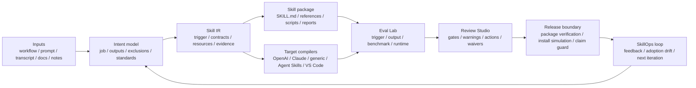

# Yao Meta Skill

[](https://github.com/yaojingang/yao-meta-skill/actions/workflows/test.yml)
[](LICENSE)
[](README.md)
[](docs/README.zh-CN.md)
[](docs/README.ja-JP.md)
[](docs/README.fr-FR.md)
[](docs/README.ru-RU.md)

`YAO` stands for `Yielding AI Outcomes`: the goal is not to generate more prompt text, but to produce reusable AI assets and real operational outcomes.

`yao-meta-skill` creates, evaluates, packages, and governs reusable agent skills. The 1.0 line focused on turning repeated workflows into installable, readable, cross-platform skill packages. The 2.0 line expands that factory into a Skill OS: a governed system for modeling a skill once, compiling it for multiple targets, testing its behavior, reviewing its release evidence, and tracking the next iteration.

[Quick Start](#quick-start) · [Skill OS 2.0](#skill-os-20-upgrade) · [1.0 vs 2.0](#from-10-to-20) · [Operator UX](#operator-ux-commands) · [Benchmark](#weighted-quality-benchmark) · [Examples](examples/README.md) · [Evals](evals/README.md) · [Failure Library](failures/README.md) · [Method Doctrine](#method-doctrine)

## Skill OS 2.0 Upgrade

Skill OS 2.0 keeps the original promise of `yao-meta-skill`, but makes the package lifecycle more explicit. Instead of stopping at `SKILL.md`, it adds a semantic contract, target compilers, evaluation evidence, release gates, and operation reports around the skill.

- **Skill IR**: a platform-neutral intermediate representation for intent, triggers, inputs, outputs, boundaries, references, and expected artifacts.
- **Target compilers and adapters**: generated surfaces for OpenAI, Claude, generic agent skills, Agent Skills compatible packages, and VS Code-oriented workflows.
- **Output Eval Lab**: trigger checks, output assertions, execution evidence, timing and token evidence, benchmark reproducibility, blind-review packs, answer keys, and adjudication reports.
- **Review Studio 2.0**: a single HTML gate page for intent, triggers, output eval, context cost, runtime checks, trust, Skill Atlas signals, adoption drift, waivers, annotations, release evidence, warnings, blockers, and fix actions.
- **Evidence and release governance**: evidence consistency checks, package verification, install simulation, runtime permission probes, world-class evidence intake, world-class ledger, operator runbook, and public claim guard.
- **SkillOps loop**: metadata-only adoption drift, telemetry hooks, adaptive proposals, daily and weekly curator reports, and portfolio-level drift signals.

Current posture: the repository is ready for beta and external testing, while stronger public "world-class" claims remain evidence-gated. Provider-backed production evidence, human blind-review evidence, native permission execution, and real-client telemetry are tracked as separate evidence tasks instead of being treated as completed work.

See the companion artifacts:

- [Visual 1.0 vs 2.0 comparison report](.previews/yao-meta-skill-2-comparison/index.html)
- [Chinese desktop preview](.previews/yao-meta-skill-2-comparison/yao-meta-skill-1-vs-2.png)
- [English desktop preview](.previews/yao-meta-skill-2-comparison/yao-meta-skill-1-vs-2-en.png)

## From 1.0 to 2.0

| Dimension | 1.0 focus | 2.0 upgrade |
| --- | --- | --- |
| Product role | Create, refactor, evaluate, and package reusable skills. | Govern the full lifecycle of a skill: creation, compilation, evaluation, review, release, telemetry, and iteration. |
| Architecture | `SKILL.md`, `agents/interface.yaml`, manifest files, and report artifacts. | Skill IR, target compilers, adapters, gate contracts, evidence ledgers, release locks, and action-oriented review pages. |
| Cross-platform delivery | OpenAI, Claude, and generic package targets. | Adds broader Agent Skills and VS Code-oriented compatibility, with registry-readable compatibility records. |
| Quality model | Trigger and structure checks plus report-based review. | Output eval, benchmark reproducibility, execution evidence, failure disclosure, blind-review packs, and evidence consistency checks. |
| Report experience | Overview HTML and first-pass review pages. | Bilingual Skill Overview v2, Review Studio 2.0, reviewer annotations, action cards, charts, and audit-oriented report contracts. |
| Release boundary | Package output with basic validation. | Package verification, install simulation, runtime permission probes, release locks, public claim guard, and operator runbooks. |
| Operating loop | Manual feedback and local iteration. | Adoption drift, metadata telemetry, SkillOps reports, adaptive proposals, and portfolio-level drift detection. |

## 2.0 Use Cases

- **Create a new skill from repeated work**: start with a workflow note, prompt set, transcript, runbook, or document pattern, then generate a package with a lean entrypoint, explicit inputs and outputs, references, reports, and the lightest justified gates.
- **Upgrade a personal skill into a team asset**: add interface contracts, manifests, target adapters, trust checks, output evals, reviewer waivers, release notes, and Review Studio evidence before other people depend on the skill.
- **Prepare a skill for beta release**: run package verification, install simulation, compatibility checks, runtime permission probes, and evidence consistency checks, then separate beta readiness from stronger public claims.
- **Keep a skill useful after release**: use metadata-only telemetry, adoption drift, feedback logs, SkillOps reports, and adaptive proposals to decide whether the next move should be documentation, an eval, a skill patch, or a governance update.
- **Compare with other meta-skill approaches**: keep Anthropic/OpenAI-style conversational creation and lean instruction writing where they fit, then use `yao-meta-skill` when the package needs evidence, portability, release gates, and repeatable maintenance.

## Operator UX Commands

These read-only helper commands turn common maintainer questions into repeatable diagnostics:

```bash
python3 scripts/yao.py install-status --expected-source .
python3 scripts/yao.py localized-doc-sync-check
python3 scripts/yao.py pr-review-report 4 --repo yaojingang/yao-meta-skill
```

- `install-status` explains whether the active skill is coming from `.codex/skills`, `.agents/skills`, or the disabled mirror, and flags duplicate active installs.
- `localized-doc-sync-check` verifies that the Chinese README carries the public homepage sections that were added to the English README.
- `pr-review-report` reads GitHub PR metadata, changed files, status checks, and suggested local commands without merging or mutating the PR.

## Capability Surface

It turns rough workflows, transcripts, prompts, notes, and runbooks into reusable skill packages with:

- a clear trigger surface
- a lean `SKILL.md`
- optional references, scripts, and evals
- a front-loaded intent dialogue with an intent confidence gate, so the system keeps clarifying when the true job, outputs, exclusions, or standards are still fuzzy
- a silent-by-default GitHub benchmark scan plus reference synthesis that studies top public repositories and world-class pattern tracks, then surfaces only real conflicts or uncertainty to the user
- a generated visual HTML overview for each newly initialized skill
- a Review Studio 2.0 HTML gate page that combines intent, trigger, output eval, context, runtime, trust, atlas, adoption drift, reviewer waivers, reviewer annotations, release evidence, and per-warning fix actions
- a Skill OS 2.0 audit that maps each world-class requirement to current evidence, human-required gaps, and external-required gaps
- a Skill OS 2.0 blueprint coverage report that maps the upgrade plan's core modules and recommended PRs to concrete artifacts, commands, and tests
- a world-class evidence plan that turns remaining provider, human, native-permission, and real-client telemetry gaps into executable evidence tasks
- a world-class evidence ledger that records which external and human evidence is accepted or still pending without treating planned work as proof
- a world-class evidence intake contract that validates external and human evidence packets for provenance, privacy, artifact refs, and anti-overclaim rules before ledger review
- a redacted world-class preflight report that checks local files, environment readiness, human/external prerequisites, and source blockers before operators collect evidence
- a world-class submission review queue that compares evidence packets, intake validation, source artifacts, and ledger state without accepting evidence
- a world-class operator runbook that gives reviewers the exact commands, artifacts, and collection checklist needed to close remaining evidence gaps
- a world-class claim guard that scans public claim surfaces and blocks premature completed/true claims while the evidence ledger still has pending external or human evidence
- a benchmark reproducibility manifest that checks methodology sections, required artifacts, failure disclosure, and reproduction commands
- an evidence consistency gate that compares generated reports against each other so benchmark, overview, interpretation, adoption, world-class ledger, coverage, and Review Studio facts do not drift silently
- Output Eval Lab evidence with assertion grading, execution/timing/token evidence, a blind A/B review pack, a separate answer key, and reviewer adjudication reports
- a runtime permission probe report that checks packaged target adapters for explicit permission metadata, native-enforcement flags, metadata fallback notes, and residual risks
- a Python compatibility gate that catches supported-runtime syntax hazards before they reach GitHub Actions or packaged distribution
- a side-by-side HTML review studio for first-pass human review
- an artifact design profile that defines visual direction, layout patterns, and quality gates for reports, tutorials, dashboards, screenshots, and review pages
- a prompt quality profile that abstracts need modeling, RTF mapping, complexity, and quality checks into reviewer-visible evidence instead of bloating `SKILL.md`
- a systems-thinking model that maps boundaries, feedback loops, drift risks, recurring failure patterns, and highest-leverage quality moves
- three high-value next iteration directions after the first package is created
- a lightweight feedback log that does not require a full promotion cycle
- a local-first metadata-only adoption and drift report that turns real usage signals into next iteration candidates, with optional `yao.py` CLI run capture, external client event emit hooks, hook recipes, and JSONL import that record command names and outcomes without arguments or raw content
- an explicit-source adaptive proposal loop that summarizes redacted repeated user preferences and generates approval-gated adaptation proposals without scanning private logs or writing source files
- a SkillOps opportunity scorer and decision policy that ranks redacted repeated signals, maps them to report-only, AGENTS update, existing-skill patch, or eval-addition actions, and keeps every durable write approval-gated
- a weekly SkillOps curator report that aggregates daily opportunities, Skill Atlas portfolio signals, release lock state, and world-class evidence gaps into a proposal-only maintenance queue
- a Browser/Chrome Native Messaging telemetry host that can receive length-prefixed metadata-only client events and generate a local launcher plus manifest without storing raw content
- a Skill Atlas drift layer that reads aggregate adoption reports and surfaces portfolio-level drift signals without packaging raw telemetry logs
- a baseline compare report for with-skill vs baseline review
- a conversation-style, archetype-aware quickstart that steers new packages toward scaffold, production, library, or governed fits
- Skill IR as the platform-neutral semantic contract, plus compiler reports and client-specific adapters
- Registry audit metadata with package version, owner, license, checksum, and compatibility matrix
- governance, promotion, and portability checks built into the default flow

## Architecture

Hero view: Skill OS 2.0 turns messy operational input into a governed, reusable skill package through a model, compile, evaluate, release, and operate loop.



Read it in 10 seconds:

- **Inputs**: start from rough operational material instead of a polished spec.
- **Intent model**: make the job, outputs, exclusions, constraints, and standards explicit before generating files.
- **Skill IR**: keep the semantic contract separate from any single platform format.
- **Package and compile**: generate the lean skill package and the target-specific adapters from the same source model.
- **Evaluate and review**: turn trigger behavior, output quality, runtime checks, and trust signals into reviewable evidence.
- **Release and operate**: publish only within the current evidence boundary, then feed adoption drift and reviewer feedback into the next iteration.

## Weighted Quality Benchmark

This benchmark is a project-level engineering review, scored from `0-10` per dimension and weighted to `100`. GitHub stars are intentionally excluded because they measure ecosystem heat, not meta-skill engineering quality.

The score is local engineering evidence, not a claim of world-class readiness. Public superiority claims still depend on accepted external and human evidence in the world-class ledger.

Weighted score formula: `sum(score / 10 * weight)`.

| Meta Skill | Method Depth 15 | Context Discipline 10 | Toolchain 15 | Eval/Test Rigor 20 | Governance 15 | Portability 10 | Onboarding/Review 5 | Local Reliability 10 | Weighted Score |
| --- | ---: | ---: | ---: | ---: | ---: | ---: | ---: | ---: | ---: |
| Yao Meta Skill | 9.5 | 8.0 | 9.5 | 9.5 | 9.5 | 9.0 | 6.5 | 9.5 | 91.5 |
| Anthropic Skill Creator | 9.0 | 6.5 | 8.5 | 7.5 | 4.0 | 5.0 | 7.5 | 5.0 | 67.5 |
| OpenAI Skill Creator | 8.5 | 9.5 | 5.0 | 2.0 | 3.0 | 4.0 | 8.5 | 4.0 | 50.5 |

| Rank | Meta Skill | Score | Core Positioning |
| ---: | --- | ---: | --- |
| 1 | Yao Meta Skill | 91.5 | A complete engineering, evaluation, governance, and portability system for reusable skills. |
| 2 | Anthropic Skill Creator | 67.5 | Strong methodology and iteration loop, with weaker local execution reliability and governance coverage. |
| 3 | OpenAI Skill Creator | 50.5 | Best treated as a concise skill-writing method guide rather than a full engineering system. |

## Human Blind A/B Review Snapshot

On 2026-06-29, a single human reviewer compared `yao-meta-skill` with the bundled OpenAI `skill-creator` across five realistic skill-creation scenarios: support triage, revenue reconciliation, webinar repurposing, incident postmortems, and PR review follow-up. The reviewer confirmed decisions were completed before the answer key was opened.

Result: `yao-meta-skill` was selected in `5/5` cases.

Evidence:

- Review entrypoint: [reports/blind-human-review-2026-06-29/index.html](reports/blind-human-review-2026-06-29/index.html)
- Adjudication summary: [reports/blind-human-review-2026-06-29/adjudication.md](reports/blind-human-review-2026-06-29/adjudication.md)
- Recorded decisions: [reports/blind-human-review-2026-06-29/review-decisions.recorded.json](reports/blind-human-review-2026-06-29/review-decisions.recorded.json)

Boundary: this is single-reviewer blind preference evidence. It is not provider-backed independent model execution evidence, and the per-case rationale fields are still empty.

## Best-Fit Scenarios

- Choose **Yao Meta Skill** when the target is a reusable team asset with explicit boundaries, trigger evaluation, governance, packaging, portability, and local execution checks.
- Choose **Anthropic Skill Creator** when the target is a conversation-first creation loop and the priority is human-guided iteration over repository-level governance.
- Choose **OpenAI Skill Creator** when the target is a compact reference for writing lean skill instructions and keeping context small.
- A practical hybrid pattern is still useful: draft conversationally, then use `yao-meta-skill` to harden the package, add evidence, and make it team-ready.

## Quick Start

Install the skill globally for Codex first:

```bash
npx -y skills add yaojingang/yao-meta-skill -a codex -g -y
```

To install it for every supported agent, replace `-a codex` with `-a '*'`:

```bash
npx -y skills add yaojingang/yao-meta-skill -a '*' -g -y
```

After installation, restart the client. Then ask for tasks such as "create a skill from this workflow", "improve this existing skill", "evaluate this skill", or "add evals to this skill" to trigger `yao-meta-skill`.

1. Describe the workflow, prompt set, or repeated task you want to turn into a skill.
2. Start with a short, human intent dialogue so the real job, outputs, exclusions, constraints, and standards are explicit.
3. Let `quickstart` clarify intent first, then run silent benchmark scan and reference synthesis; it only surfaces explicit questions when intent is still unclear or when there is a real design conflict.
4. Use the archetype-aware `quickstart` or the full authoring flow to generate or improve the package in scaffold, production, library, or governed mode.
5. Review the generated `reports/skill-interpretation.html` first for the bilingual interpretation report. It defaults to Simplified Chinese and provides an English switch in the top right. Then open `reports/skill-overview.html` for the audit scorecard and `reports/review-studio.html` to inspect release blockers, permission approvals, and evidence paths in one page before adding more structure.

Or use the unified authoring CLI:

```bash
python3 scripts/yao.py quickstart --output-dir .
python3 scripts/yao.py github-benchmark-scan my-skill --query "release workflow portability"
python3 scripts/yao.py reference-scan my-skill \
  --external-reference "World Class Method::method::Borrow a tight evaluation loop.::Do not copy heavy process." \
  --user-reference "A product or repo I admire::taste::Learn the clarity and operating standard.::Do not copy wording." \
  --local-constraint "Current Library Naming::structure::Keep naming aligned with the local skill library.::Do not inherit private references."
python3 scripts/yao.py skill-interpretation my-skill
python3 scripts/yao.py review-viewer my-skill
python3 scripts/yao.py review-studio my-skill
python3 scripts/yao.py artifact-design-profile my-skill
python3 scripts/yao.py prompt-quality-profile my-skill
python3 scripts/yao.py system-model my-skill
python3 scripts/yao.py feedback my-skill --note "Tighten exclusions before adding scripts." --rating 4 --category boundary
python3 scripts/yao.py adapt-scan my-skill --source ./curated-user-signals.jsonl
python3 scripts/yao.py adapt-propose my-skill
python3 scripts/yao.py daily-skillops my-skill --source ./curated-user-signals.jsonl
python3 scripts/yao.py weekly-curator my-skill
python3 scripts/yao.py adoption-drift my-skill --record-event skill_activation --activation-type explicit --outcome accepted
YAO_CLI_TELEMETRY=1 python3 scripts/yao.py validate my-skill
python3 scripts/yao.py telemetry-emit my-skill --event skill_activation --activation-type explicit --outcome accepted --command browser-extension
python3 scripts/yao.py telemetry-hooks my-skill
python3 scripts/telemetry_native_host.py my-skill --write-launcher /tmp/yao-telemetry-host.sh --write-manifest /tmp/yao-telemetry-host.json --allowed-origin chrome-extension://aaaaaaaaaaaaaaaaaaaaaaaaaaaaaaaa/
python3 scripts/yao.py telemetry-import my-skill --input-jsonl /tmp/external-client-events.jsonl --command browser-extension
python3 scripts/yao.py review-waivers my-skill --add-waiver --gate-key trust-report --reviewer "Yao Team" --reason "Known warning accepted for this release with bounded follow-up." --expires-at 2026-09-30
python3 scripts/yao.py review-waivers my-skill --add-waiver --gate-key permission-gates --reviewer "Yao Team" --reason "Permission warning accepted only for this non-governed release window." --expires-at 2026-09-30
python3 scripts/yao.py review-annotations my-skill --add-annotation --gate-key output-lab --target-path reports/output_quality_scorecard.md --line 1 --body "Clarify recorded fixture vs model-executed evidence before release."
python3 scripts/yao.py baseline-compare
python3 scripts/yao.py check-update
python3 scripts/yao.py skill-ir . --output-json skill-ir/examples/yao-meta-skill.json
python3 scripts/yao.py compile-skill . --target openai --target claude --target generic --target vscode
python3 scripts/yao.py package . --platform generic --output-dir dist
python3 scripts/yao.py output-eval
python3 scripts/yao.py output-exec
python3 scripts/yao.py output-review
python3 scripts/yao.py conformance .
python3 scripts/yao.py trust .
python3 scripts/yao.py python-compat .
python3 scripts/yao.py runtime-permissions . --package-dir dist
python3 scripts/yao.py skill-atlas --workspace-root .
python3 scripts/yao.py registry-audit .
python3 scripts/yao.py package-verify . --package-dir dist --require-zip
python3 scripts/yao.py install-simulate . --package-dir dist
python3 scripts/yao.py upgrade-check . --previous-package-json registry/examples/yao-meta-skill-1.0.0.json
python3 scripts/yao.py world-class-evidence .
SUBMISSIONS_DIR="${SUBMISSIONS_DIR:-evidence/world_class/submissions}"
python3 scripts/yao.py world-class-preflight . --submissions-dir "$SUBMISSIONS_DIR"
python3 scripts/yao.py world-class-submission-kit . --output-dir "$SUBMISSIONS_DIR"
# Alternative: prefill artifact SHA-256 digests while keeping drafts template-only.
python3 scripts/yao.py world-class-submission-kit . --output-dir "$SUBMISSIONS_DIR" --prefill-artifacts
python3 scripts/yao.py world-class-intake . --submissions-dir "$SUBMISSIONS_DIR"
python3 scripts/yao.py world-class-submission-review . --submissions-dir "$SUBMISSIONS_DIR"
python3 scripts/yao.py world-class-ledger . --submissions-dir "$SUBMISSIONS_DIR"
python3 scripts/yao.py world-class-runbook . --submissions-dir "$SUBMISSIONS_DIR"
python3 scripts/yao.py world-class-claim-guard .
python3 scripts/yao.py benchmark-reproducibility .
python3 scripts/yao.py evidence-consistency .
```

## Local Development Source

Development source: this repository is the source of truth for authoring and review.

Use Python 3.11 or newer for local development. GitHub Actions runs the test suite on Python 3.11, and the Makefile checks the active interpreter before running `make test` or `make ci-test`.

```bash
python3.11 -m venv .venv
source .venv/bin/activate
python -m pip install --upgrade pip
python -m pip install --requirement requirements-ci.txt
make ci-test
```

If `python3` points to an older system interpreter, pass the interpreter explicitly:

```bash
make PYTHON=python3.11 ci-test
```

Disabled mirror: `~/.agents/skills.disabled/yao-meta-skill` is the local backup mirror for this source. Keeping the mirror outside `~/.agents/skills` prevents Codex from showing a duplicate `Yao Meta Skill` while this repository is also visible in the active workspace.

Sync the current source into the disabled mirror:

```bash
make sync-local-install
```

The sync command first rebuilds the package and runs install preflight against `dist/yao-meta-skill.zip`. It refuses to sync when package extraction, adapter readability, or installer permission enforcement fails. After the preflight passes, it copies Git-tracked files plus new source files in code and guidance directories such as `scripts/`, `tests/`, `references/`, and `docs/`. It skips untracked business-skill folders and untracked private reports by default, so local experiments do not leak into the mirror.

Restore an active global Codex install only when you intentionally want this skill discoverable outside the development workspace:

```bash
make sync-active-install
```

That active install writes to `~/.agents/skills/yao-meta-skill` and can make Codex show a second `Yao Meta Skill` entry while this repository is open as a skills workspace.

## Generated Artifact Boundaries

Keep this repository focused on the meta-skill factory.

- Put reusable factory examples in `examples/`.
- Name embedded example entrypoints `SKILL.example.md`; reserve the exact `SKILL.md` filename for the installable root skill so recursive agent discovery does not activate examples or test fixtures.
- Put reusable benchmark evidence, regression results, and release evidence in `reports/`.
- Keep private analysis reports, customer-specific outputs, and one-off generated business skills outside this repository unless they are intentionally promoted into an example or regression fixture.
- Place real generated skills as sibling skill directories under the local skill workspace, not as top-level folders inside `yao-meta-skill`.

## 5-Minute Workflow

1. Start from a raw workflow note.
2. Turn it into a skill package with `SKILL.md`, `agents/interface.yaml`, and only the folders the workflow actually needs.
3. Validate the trigger description with `evals/trigger_cases.json`.
4. Export compatibility artifacts for the clients you care about.
5. Compare the result against the examples in `examples/`.

Minimum commands:

```bash
python3 scripts/trigger_eval.py --description-file evals/improved_description.txt --cases evals/trigger_cases.json
python3 scripts/run_description_optimization_suite.py
python3 scripts/judge_blind_eval.py --description-file SKILL.md --cases evals/blind_holdout/trigger_cases.json --semantic-config evals/semantic_config.json
python3 scripts/context_sizer.py .
python3 scripts/resource_boundary_check.py .
python3 scripts/governance_check.py . --require-manifest
python3 scripts/compile_skill.py .
python3 scripts/cross_packager.py . --platform openai --platform claude --platform generic --platform vscode --expectations evals/packaging_expectations.json --zip
python3 scripts/probe_runtime_permissions.py . --package-dir dist
python3 tests/verify_packager_failures.py
```

Or run everything together:

```bash
make test
```

Unified authoring flow:

```bash
python3 scripts/yao.py init my-skill --description "Describe what the skill does."
python3 scripts/yao.py validate my-skill
python3 scripts/yao.py workspace-flow --target root --label first-pass
python3 scripts/yao.py review-viewer my-skill
python3 scripts/yao.py review --target root
python3 scripts/yao.py release-snapshot --target root --label release-candidate
python3 scripts/yao.py skill-ir . --output-json skill-ir/examples/yao-meta-skill.json
python3 scripts/yao.py compile-skill .
python3 scripts/yao.py package . --platform openai --platform claude --platform generic --platform vscode --output-dir dist --zip
python3 scripts/yao.py runtime-permissions . --package-dir dist
python3 scripts/yao.py package-verify . --package-dir dist --require-zip
python3 scripts/yao.py test
```

## Results

The homepage panel below is generated from the current eval suite so the family-level outcome is visible without opening raw JSON.

<!-- BEGIN:EVAL_RESULTS -->
- regression corpus: `66` prompts across `21` families
- aggregate result: `0` false positives, `0` false negatives, average precision `1.0`, average recall `1.0`
- suite status:

| Suite | Cases | FP | FN | Precision | Recall |
| --- | ---: | ---: | ---: | ---: | ---: |
| train | 31 | 0 | 0 | 1.0 | 1.0 |
| dev | 22 | 0 | 0 | 1.0 | 1.0 |
| holdout | 13 | 0 | 0 | 1.0 | 1.0 |

| Family | Cases | Pass Rate |
| --- | ---: | ---: |
| `brainstorm_only` | 2 | 1.0 |
| `brainstorm_vs_build` | 1 | 1.0 |
| `complex_multi_asset` | 3 | 1.0 |
| `document_export_vs_agent_skill` | 4 | 1.0 |
| `document_only` | 3 | 1.0 |
| `explain_not_package` | 1 | 1.0 |
| `explain_only` | 5 | 1.0 |
| `future_outline_vs_build` | 4 | 1.0 |
| `iterate_existing_skill` | 5 | 1.0 |
| `long_context_document_only` | 3 | 1.0 |
| `long_context_near_neighbor` | 3 | 1.0 |
| `long_context_summary_only` | 2 | 1.0 |
| `long_context_trigger` | 4 | 1.0 |
| `meta_skill_creation` | 1 | 1.0 |
| `one_off_vs_reusable` | 2 | 1.0 |
| `package_for_team` | 2 | 1.0 |
| `paraphrase_trigger` | 5 | 1.0 |
| `partial_scaffold_not_full_skill` | 4 | 1.0 |
| `summary_only` | 3 | 1.0 |
| `translate_only` | 4 | 1.0 |
| `workflow_to_skill` | 5 | 1.0 |

Full reports: [reports/eval_suite.json](reports/eval_suite.json) and [reports/family_summary.md](reports/family_summary.md)
<!-- END:EVAL_RESULTS -->

- packaging validation: `openai`, `claude`, `generic`, and `vscode` targets pass contract checks and carry IR provenance, semantic parity metadata, and target-native behavior contracts
- target compiler validation: `openai`, `claude`, `generic`, Agent Skills compatible, and VS Code / Copilot contracts are compiled from Skill IR with generated-file mappings, adapter modes, native surfaces